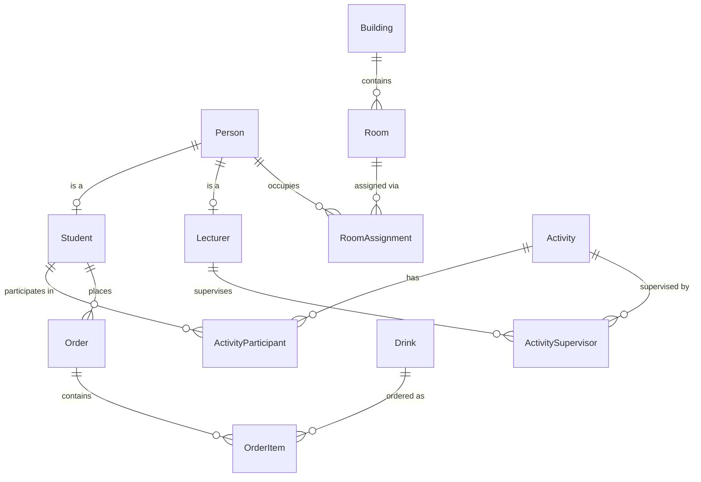

# Project Databases – Assignment 1: Someren Database

**Course:** Project Databases  
**Group members:** Marnix, Jan, Nout  
**Date:** <!-- TODO: fill in submission date before exporting to PDF -->  
**Sprint:** 1

---

## Table of Contents

1. [Case Description](#1-case-description)
2. [Entity-Relationship Diagram (ERD)](#2-entity-relationship-diagram-erd)
   - 2.1 [Entities and Attributes](#21-entities-and-attributes)
   - 2.2 [Relationships, Cardinalities and Totalities](#22-relationships-cardinalities-and-totalities)
   - 2.3 [ERD Diagram](#23-erd-diagram)
3. [Relational Model](#3-relational-model)
4. [SQL Schema](#4-sql-schema)
5. [User Stories & Checklist](#5-user-stories--checklist)
6. [Appendix: How to Export to PDF](#6-appendix-how-to-export-to-pdf)

---

## 1. Case Description

In May all first-year Informatics students and lecturers go on a study trip to Someren.
For every student and lecturer the following data is recorded: first name, last name and
phone number. In addition, students have a student number and class; lecturers have an
age.

The group stays in two buildings. The buildings contain dormitories for students (eight
beds each) and single rooms for lecturers. During the stay, activities are organised such
as a puzzle hunt, a football tournament and an obstacle course. Students participate as
participants; lecturers act as supervisors.

On the disco evening students can order drinks. For every drink the following information
is stored: name, price, VAT rate (9 % or 21 %) and stock quantity. For every order it is
recorded which student bought which drink in what quantity.

---

## 2. Entity-Relationship Diagram (ERD)

### 2.1 Entities and Attributes

| Entity | Attributes |
|---|---|
| **Person** | personId (PrimaryKey), firstName, lastName, phoneNumber (ForeignKey)| 
| **Student** | studentId (PrimaryKey) personId (ForeignKey > Person), studentNumber, class (ForeignKey) | 
| **Lecturer** |lectureId (PrimaryKey)  personId (ForeignKey > Person), age  | 
| **Building** | buildingId (PrimaryKey), name | 
| **Room** | roomId (PrimaryKey), buildingId (ForeignKey > Building), roomNumber, capacity, isTeacherRoom capacity = 8 | 
| **RoomAssignment** | personId (PrimaryKey/ForeignKey > Person), roomId (ForeignKey > Room) | 
| **Activity** | activityId (PrimaryKey), name, startTime, endTime | 
| **ActivityParticipant** | studentId (PrimaryKey/ForeignKey > Student), activityId (ForeignKey > Activity) |  
| **ActivitySupervisor** | lecturerId (PrimaryKey/ForeignKey > Lecturer), activityId (ForeignKey > Activity) | 
| **Drink** | drinkId (PrimaryKey), name, price, vatRate, stock | 
| **Order** | orderId (PrimaryKey), studentId (ForeignKey > Student), orderDate | 
| **OrderItem** | orderId (PrimaryKey/ForeignKey > Order), drinkId (ForeignKey > Drink), quantity | 

### 2.2 ERD Diagram

> The diagram below is rendered automatically by GitHub Markdown and by tools such as
> Mermaid Live Editor (<https://mermaid.live>).
> The standalone `.mmd` source file is located at `diagrams/erd.mmd`.



#### Entity Attributes

| Entity | Attribute | Type | Key |
|---|---|---|---|
| Person | person_id | INT | PK |
| Person | first_name | VARCHAR(50) | |
| Person | last_name | VARCHAR(50) | |
| Person | phone_number | VARCHAR(20) | |
| Student | person_id | INT | PK, FK → Person |
| Student | student_number | VARCHAR(50) | |
| Student | class | VARCHAR(50) | |
| Lecturer | person_id | INT | PK, FK → Person |
| Lecturer | age | INT | |
| Building | building_id | INT | PK |
| Building | name | VARCHAR(100) | |
| Room | room_id | INT | PK |
| Room | building_id | INT | FK → Building |
| Room | room_number | VARCHAR(10) | |
| Room | capacity | INT | |
| Room | is_teacher_room | BIT | |
| RoomAssignment | person_id | INT | PK, FK → Person |
| RoomAssignment | room_id | INT | PK, FK → Room |
| Activity | activity_id | INT | PK |
| Activity | name | VARCHAR(100) | |
| Activity | start_time | DATETIME | |
| Activity | end_time | DATETIME | |
| ActivityParticipant | student_id | INT | PK, FK → Student |
| ActivityParticipant | activity_id | INT | PK, FK → Activity |
| ActivitySupervisor | lecturer_id | INT | PK, FK → Lecturer |
| ActivitySupervisor | activity_id | INT | PK, FK → Activity |
| Drink | drink_id | INT | PK |
| Drink | name | VARCHAR(100) | |
| Drink | price | DECIMAL(10,2) | |
| Drink | vat_rate | DECIMAL(4,2) | |
| Drink | stock | INT | |
| Order | order_id | INT | PK |
| Order | student_id | INT | FK → Student |
| Order | order_date | DATETIME | |
| OrderItem | order_id | INT | PK, FK → Order |
| OrderItem | drink_id | INT | PK, FK → Drink |
| OrderItem | quantity | INT | |

---

## 3. Relational Model

> Convention used below:
> - **<u>PK</u>** = Primary Key (represented here as bold + underline notation in text)
> - *FK* = Foreign Key (italic)
>
> In academic notation:
> - PK attributes are **underlined**
> - FK attributes are in *italics*

### Person (<u>person_id</u>, first_name, last_name, phone_number)

| Attribute | Type | Constraint |
|---|---|---|
| **person_id** | INT | PRIMARY KEY, IDENTITY |
| first_name | VARCHAR(50) | NOT NULL |
| last_name | VARCHAR(50) | NOT NULL |
| phone_number | VARCHAR(20) | NULL |

---

### Student (<u>*person_id*</u>, student_number, class)

| Attribute | Type | Constraint |
|---|---|---|
| ***person_id*** | INT | PRIMARY KEY, FOREIGN KEY → Person(person_id) |
| student_number | VARCHAR(50) | NOT NULL |
| class | VARCHAR(50) | NOT NULL |

---

### Lecturer (<u>*person_id*</u>, age)

| Attribute | Type | Constraint |
|---|---|---|
| ***person_id*** | INT | PRIMARY KEY, FOREIGN KEY → Person(person_id) |
| age | INT | NOT NULL |

---

### Building (<u>building_id</u>, name)

| Attribute | Type | Constraint |
|---|---|---|
| **building_id** | INT | PRIMARY KEY, IDENTITY |
| name | VARCHAR(100) | NOT NULL |

---

### Room (<u>room_id</u>, *building_id*, room_number, capacity, is_teacher_room)

| Attribute | Type | Constraint |
|---|---|---|
| **room_id** | INT | PRIMARY KEY, IDENTITY |
| *building_id* | INT | NOT NULL, FOREIGN KEY → Building(building_id) |
| room_number | VARCHAR(10) | NOT NULL |
| capacity | INT | NOT NULL |
| is_teacher_room | BIT | NOT NULL |

---

### RoomAssignment (<u>*person_id*</u>, <u>*room_id*</u>)

| Attribute | Type | Constraint |
|---|---|---|
| ***person_id*** | INT | PK (composite), FOREIGN KEY → Person(person_id) |
| ***room_id*** | INT | PK (composite), FOREIGN KEY → Room(room_id) |

---

### Activity (<u>activity_id</u>, name, start_time, end_time)

| Attribute | Type | Constraint |
|---|---|---|
| **activity_id** | INT | PRIMARY KEY, IDENTITY |
| name | VARCHAR(100) | NOT NULL |
| start_time | DATETIME | NOT NULL |
| end_time | DATETIME | NOT NULL |

---

### ActivityParticipant (<u>*student_id*</u>, <u>*activity_id*</u>)

| Attribute | Type | Constraint |
|---|---|---|
| ***student_id*** | INT | PK (composite), FOREIGN KEY → Student(person_id) |
| ***activity_id*** | INT | PK (composite), FOREIGN KEY → Activity(activity_id) |

---

### ActivitySupervisor (<u>*lecturer_id*</u>, <u>*activity_id*</u>)

| Attribute | Type | Constraint |
|---|---|---|
| ***lecturer_id*** | INT | PK (composite), FOREIGN KEY → Lecturer(person_id) |
| ***activity_id*** | INT | PK (composite), FOREIGN KEY → Activity(activity_id) |

---

### Drink (<u>drink_id</u>, name, price, vat_rate, stock)

| Attribute | Type | Constraint |
|---|---|---|
| **drink_id** | INT | PRIMARY KEY, IDENTITY |
| name | VARCHAR(100) | NOT NULL |
| price | DECIMAL(10,2) | NOT NULL |
| vat_rate | DECIMAL(4,2) | NOT NULL — must be 0.09 or 0.21 |
| stock | INT | NOT NULL |

---

### Order (<u>order_id</u>, *student_id*, order_date)

| Attribute | Type | Constraint |
|---|---|---|
| **order_id** | INT | PRIMARY KEY, IDENTITY |
| *student_id* | INT | NOT NULL, FOREIGN KEY → Student(person_id) |
| order_date | DATETIME | NOT NULL |

---

### OrderItem (<u>*order_id*</u>, <u>*drink_id*</u>, quantity)

| Attribute | Type | Constraint |
|---|---|---|
| ***order_id*** | INT | PK (composite), FOREIGN KEY → Order(order_id) |
| ***drink_id*** | INT | PK (composite), FOREIGN KEY → Drink(drink_id) |
| quantity | INT | NOT NULL |

---

## 4. SQL Schema

> The full SQL script is stored separately at `someren_sql_schema.sql` (root) and can
> also be viewed in `sql/someren_sql_schema.sql` once that folder is created.
> Import it into SQL Server (or a compatible database) to create all tables.

```sql
-- SQL schema for Someren database project

-- Table: Person
CREATE TABLE Person (
    person_id INT IDENTITY(1,1) PRIMARY KEY,
    first_name VARCHAR(50) NOT NULL,
    last_name VARCHAR(50) NOT NULL,
    phone_number VARCHAR(20)
);

-- Table: Student
CREATE TABLE Student (
    person_id INT PRIMARY KEY,
    student_number VARCHAR(50) NOT NULL,
    class VARCHAR(50) NOT NULL,
    CONSTRAINT FK_Student_Person FOREIGN KEY (person_id) REFERENCES Person(person_id)
);

-- Table: Lecturer
CREATE TABLE Lecturer (
    person_id INT PRIMARY KEY,
    age INT NOT NULL,
    CONSTRAINT FK_Lecturer_Person FOREIGN KEY (person_id) REFERENCES Person(person_id)
);

-- Table: Building
CREATE TABLE Building (
    building_id INT IDENTITY(1,1) PRIMARY KEY,
    name VARCHAR(100) NOT NULL
);

-- Table: Room
CREATE TABLE Room (
    room_id INT IDENTITY(1,1) PRIMARY KEY,
    building_id INT NOT NULL,
    room_number VARCHAR(10) NOT NULL,
    capacity INT NOT NULL,
    is_teacher_room BIT NOT NULL,
    CONSTRAINT FK_Room_Building FOREIGN KEY (building_id) REFERENCES Building(building_id)
);

-- Table: RoomAssignment
CREATE TABLE RoomAssignment (
    person_id INT NOT NULL,
    room_id INT NOT NULL,
    PRIMARY KEY (person_id, room_id),
    CONSTRAINT FK_RoomAssignment_Person FOREIGN KEY (person_id) REFERENCES Person(person_id),
    CONSTRAINT FK_RoomAssignment_Room FOREIGN KEY (room_id) REFERENCES Room(room_id)
);

-- Table: Activity
CREATE TABLE Activity (
    activity_id INT IDENTITY(1,1) PRIMARY KEY,
    name VARCHAR(100) NOT NULL,
    start_time DATETIME NOT NULL,
    end_time DATETIME NOT NULL
);

-- Table: ActivityParticipant
CREATE TABLE ActivityParticipant (
    student_id INT NOT NULL,
    activity_id INT NOT NULL,
    PRIMARY KEY (student_id, activity_id),
    CONSTRAINT FK_ActivityParticipant_Student FOREIGN KEY (student_id) REFERENCES Student(person_id),
    CONSTRAINT FK_ActivityParticipant_Activity FOREIGN KEY (activity_id) REFERENCES Activity(activity_id)
);

-- Table: ActivitySupervisor
CREATE TABLE ActivitySupervisor (
    lecturer_id INT NOT NULL,
    activity_id INT NOT NULL,
    PRIMARY KEY (lecturer_id, activity_id),
    CONSTRAINT FK_ActivitySupervisor_Lecturer FOREIGN KEY (lecturer_id) REFERENCES Lecturer(person_id),
    CONSTRAINT FK_ActivitySupervisor_Activity FOREIGN KEY (activity_id) REFERENCES Activity(activity_id)
);

-- Table: Drink
CREATE TABLE Drink (
    drink_id INT IDENTITY(1,1) PRIMARY KEY,
    name VARCHAR(100) NOT NULL,
    price DECIMAL(10,2) NOT NULL,
    vat_rate DECIMAL(4,2) NOT NULL,
    stock INT NOT NULL
);

-- Table: Order
CREATE TABLE [Order] (
    order_id INT IDENTITY(1,1) PRIMARY KEY,
    student_id INT NOT NULL,
    order_date DATETIME NOT NULL,
    CONSTRAINT FK_Order_Student FOREIGN KEY (student_id) REFERENCES Student(person_id)
);

-- Table: OrderItem
CREATE TABLE OrderItem (
    order_id INT NOT NULL,
    drink_id INT NOT NULL,
    quantity INT NOT NULL,
    PRIMARY KEY (order_id, drink_id),
    CONSTRAINT FK_OrderItem_Order FOREIGN KEY (order_id) REFERENCES [Order](order_id),
    CONSTRAINT FK_OrderItem_Drink FOREIGN KEY (drink_id) REFERENCES Drink(drink_id)
);
```

---

## 5. User Stories & Checklist

### User Story 1 – Design an ERD

> *As a developer, I want to easily view the database structure via an ERD diagram,
> so that I can easily understand, modify and integrate with the database schema.*

**Checklist:**

- [x] Analyse the Someren case and identify all entities, relationships and attributes
- [x] Ensure the ERD contains all entities, relationships and attributes
- [x] Add cardinality (1, n, m) and totality (O = optional / T = total) to every relationship; describe them in text
- [x] Review and discuss the ERD within the group

### User Story 2 – Convert the ERD into a relational model

> *As a developer, I want to have a relational model based on the ERD diagram,
> so that I can create and use a well-structured database for my application.*

**Checklist:**

- [x] Give every entity and junction table a unique name
- [x] Provide every entity with a primary key
- [x] Convert all M:N relationships into three tables (two entity tables + one junction table)
- [x] Add the correct foreign key to the N-side for 1:N relationships
- [x] Implement attribute columns and foreign key in one of the two tables for 1:1 relationships
- [x] Enforce mandatory participation with NOT NULL constraints and ensure referential integrity
- [x] Review and discuss the relational model within the group

---

## 6. Appendix: How to Export to PDF

See `submission/pdf_export_instructions.md` for step-by-step instructions on generating
a PDF from this Markdown file (including the rendered Mermaid ERD).
